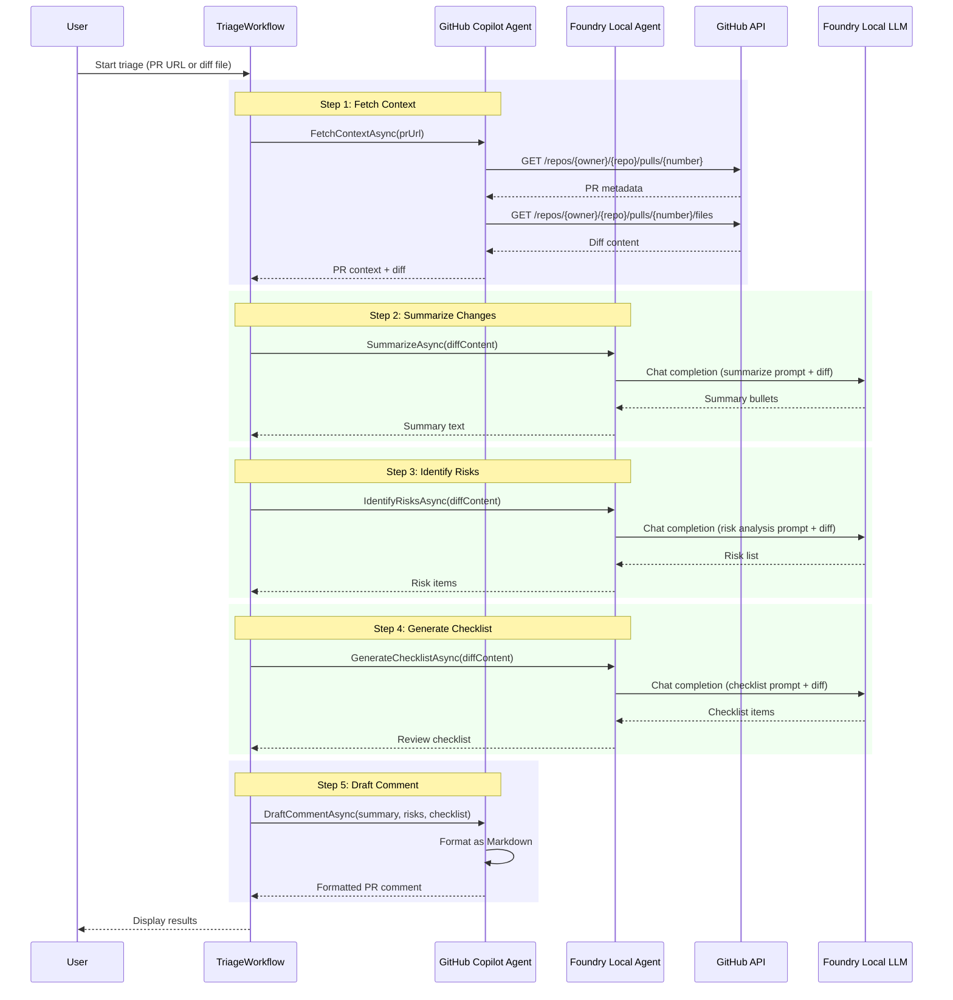

# Architecture Overview

This document describes the technical architecture of the Repo Triage Agent, demonstrating how the Microsoft Agent Framework orchestrates a multi-agent workflow.

---

## System Overview

The application implements a **two-agent architecture** where specialized agents handle different aspects of PR triage:

1. **GitHub Copilot Agent** — Handles GitHub-specific operations (PR fetching, diff retrieval, comment formatting)
2. **Foundry Local Agent** — Performs AI analysis (summarization, risk identification, checklist generation)

Both agents follow the Microsoft Agent Framework patterns and communicate through the `TriageWorkflow` orchestrator.

---

## Workflow Sequence

The triage process follows a 5-step sequence:



---

## Agent Responsibility Matrix

| Step | Agent | Framework Pattern | Input | Output | Purpose |
|------|-------|-------------------|-------|--------|---------|
| **1. Fetch Context** | GitHub Copilot Agent | `CopilotClient.AsAIAgent()` | PR URL or diff file path | PR metadata + diff content | Retrieve GitHub data using authenticated API calls |
| **2. Summarize** | Foundry Local Agent | `ChatClientAgent` with `IChatClient` | Diff content | Summary bullets | Extract key changes in human-readable form |
| **3. Identify Risks** | Foundry Local Agent | `ChatClientAgent` with `IChatClient` | Diff content | Risk list | Detect security, performance, or breaking changes |
| **4. Generate Checklist** | Foundry Local Agent | `ChatClientAgent` with `IChatClient` | Diff content | Review checklist | Create reviewer action items |
| **5. Draft Comment** | GitHub Copilot Agent | `CopilotClient.AsAIAgent()` | Summary + risks + checklist | Formatted Markdown | Combine results into PR-ready comment |

---

## Data Flow

### Input Sources

```
┌─────────────────┐         ┌──────────────────┐
│  GitHub PR URL  │   OR    │  Local .diff file│
└────────┬────────┘         └────────┬─────────┘
         │                           │
         └───────────┬───────────────┘
                     ↓
         ┌───────────────────────┐
         │   TriageWorkflow      │
         │   (Orchestrator)      │
         └───────────────────────┘
```

### Processing Pipeline

```
┌───────────────────────────────────────────────────────────┐
│                     TriageWorkflow                        │
└───────────────────────────────────────────────────────────┘
         │                                  │
         ↓                                  ↓
┌────────────────────┐           ┌──────────────────────┐
│ GitHub Copilot     │           │ Foundry Local Agent  │
│ Agent              │           │ (ChatClientAgent)    │
│                    │           │                      │
│ • Fetch PR context │           │ • Summarize changes  │
│ • Draft comment    │           │ • Identify risks     │
│                    │           │ • Generate checklist │
└────────┬───────────┘           └──────────┬───────────┘
         │                                  │
         ↓                                  ↓
   ┌──────────┐                    ┌──────────────┐
   │ GitHub   │                    │ Foundry      │
   │ REST API │                    │ Local LLM    │
   └──────────┘                    │ (phi-4)      │
                                   └──────────────┘
```

### Output Structure

```
┌────────────────────────────────────────┐
│         TriageResult                   │
├────────────────────────────────────────┤
│ • Summary: string                      │
│   └─ Bullet points of key changes      │
│                                        │
│ • Risks: List<string>                  │
│   └─ Security, performance, breaking   │
│                                        │
│ • ReviewChecklist: List<string>        │
│   └─ Action items for reviewers        │
│                                        │
│ • SuggestedComment: string             │
│   └─ Markdown-formatted PR comment     │
└────────────────────────────────────────┘
         │
         ↓
┌────────────────────────────────────────┐
│        ConsoleUi.Render()              │
│    (Spectre.Console formatting)        │
└────────────────────────────────────────┘
```

---

## Agent Implementation Details

### GitHub Copilot Agent Pattern

```csharp
// From Microsoft.Agents.AI.GitHub.Copilot
await using CopilotClient copilotClient = new();
await copilotClient.StartAsync();

AIAgent agent = copilotClient.AsAIAgent(
    tools: [fetchPrTool, getDiffTool, draftCommentTool],
    instructions: "You are a PR triage assistant...");

// Streaming execution
await foreach (var update in agent.RunStreamingAsync(prompt))
{
    Console.Write(update);
}
```

**Key Features:**
- Built-in GitHub authentication via Copilot CLI session
- Tool/function calling for specific operations
- Structured request/response patterns
- Session management for context retention

### Foundry Local Agent Pattern (ChatClientAgent)

```csharp
// IChatClient pointing to Foundry Local's OpenAI-compatible endpoint
IChatClient chatClient = new OpenAIClient(
    new Uri("http://localhost:5272/v1"),
    new ApiKeyCredential("not-needed"));

AIAgent agent = new ChatClientAgent(
    chatClient,
    instructions: "You analyze code diffs for risks...",
    name: "RiskAnalyzer");

// Streaming execution
await foreach (var update in agent.RunStreamingAsync(diffContent))
{
    yield return update;
}
```

**Key Features:**
- **`IChatClient` abstraction** enables swappable LLM backends (Azure OpenAI, OpenAI, Anthropic, etc.)
- No vendor lock-in — change providers with configuration, not code
- Streaming support for better UX
- Reusable agent instances with different instructions

---

## Error Handling & Resilience

```
┌─────────────────────────────────────────────┐
│            Error Handling Flow              │
└─────────────────────────────────────────────┘

1. Network Failures (GitHub API, Foundry Local)
   └─→ Retry with exponential backoff (3 attempts)
       └─→ If all retries fail: graceful degradation
           └─→ Show error message + suggest --mock mode

2. LLM Failures (malformed response, timeout)
   └─→ Log diagnostic information
       └─→ Retry with simplified prompt
           └─→ If still fails: return fallback response

3. Validation Failures (invalid PR URL, missing diff)
   └─→ Early exit with clear error message
       └─→ Suggest correct usage pattern
```

### Retry Configuration

| Operation | Max Retries | Backoff | Timeout |
|-----------|-------------|---------|---------|
| GitHub API calls | 3 | Exponential (1s, 2s, 4s) | 30s per call |
| Foundry Local LLM | 3 | Exponential (2s, 4s, 8s) | 60s per call |
| File I/O | 1 | None | 10s |

---

## Session Management

### Multi-Turn Context

Both agent types support session management for context retention:

```csharp
// Create session for multi-turn conversation
var sessionId = Guid.NewGuid().ToString();

// First turn: "Summarize this diff"
var response1 = await agent.RunAsync(
    prompt: diffContent,
    sessionId: sessionId);

// Second turn: "What are the security risks?" (uses previous context)
var response2 = await agent.RunAsync(
    prompt: "Based on the summary, identify security risks.",
    sessionId: sessionId);
```

**Current Usage:** Single-turn requests (each step is independent)  
**Future Enhancement:** Multi-turn refinement (e.g., "Make the summary more concise")

---

## Performance Considerations

### Token Usage

| Step | Typical Input Tokens | Typical Output Tokens | Time (phi-4 on GPU) |
|------|---------------------|----------------------|---------------------|
| Summarize | 500-2000 | 50-150 | 2-5s |
| Identify Risks | 500-2000 | 100-200 | 3-6s |
| Generate Checklist | 500-2000 | 75-150 | 2-5s |

### Optimization Strategies

1. **Parallel Processing** — Steps 2, 3, and 4 are independent and can run in parallel
2. **Caching** — Reuse diff content across steps (avoid re-fetching from GitHub)
3. **Streaming** — Display tokens as they arrive for better perceived performance
4. **Model Selection** — Use smaller models (phi-4) for faster inference on local hardware

---

## References

- [Microsoft Agent Framework Documentation](https://learn.microsoft.com/en-us/agent-framework/)
- [GitHub Copilot Agents](https://learn.microsoft.com/en-us/agent-framework/user-guide/agents/agent-types/github-copilot-agent?pivots=programming-language-csharp)
- [Chat Client Agent](https://learn.microsoft.com/en-us/agent-framework/user-guide/agents/agent-types/chat-client-agent?pivots=programming-language-csharp)
- [IChatClient Abstraction (Microsoft.Extensions.AI)](https://learn.microsoft.com/en-us/dotnet/ai/conceptual/abstractions)
